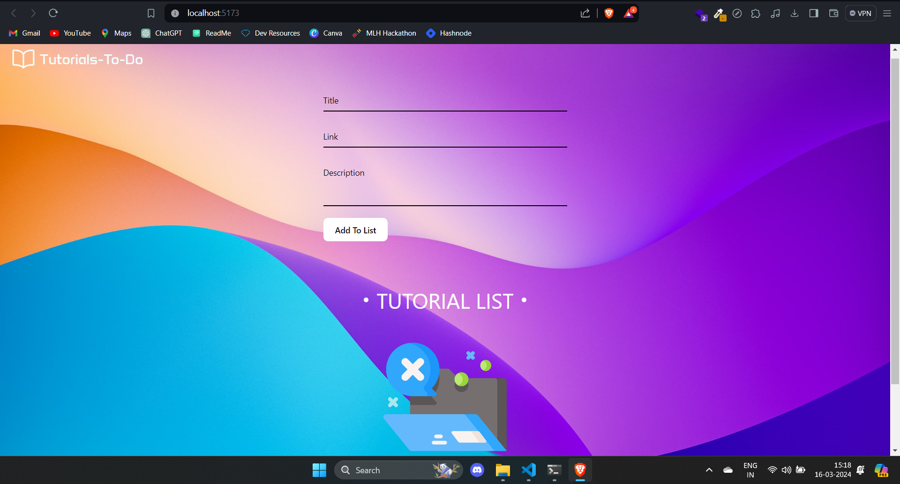

# Introduction

A minimalist and responsive to-do type of website by which user can keep track of tutorials or lectures they need to complete. Local storage support using Zustand, ensuring a seamless user experience and efficient data management.
# Installation

To run this project on your local environment, you need to fork and copy the repo to your local environment first

- Then get inside the project folder in your local environment
```bash
  cd tutorials_to_do
```

- Install node modeules

```bash
  npm i
```
- Then run the dev server

```bash
  npm run dev
```
# Demo




